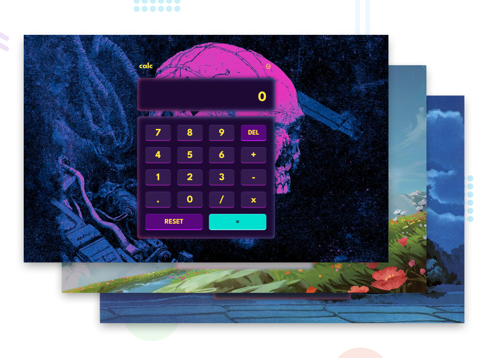

## Frontend Mentor - Calculator App Solution

This is a solution to the [Calculator app challenge on Frontend Mentor](https://www.frontendmentor.io/challenges/calculator-app-9lteq5N29). Frontend Mentor challenges help you improve your coding skills by building realistic projects.

<p>
  <a href="https://www.frontendmentor.io/solutions/interactive-calculator-with-keyboard-navigation-3-themes-t3XCAeHlEY">
    </a>
  <a href="https://haquanq-frontendmentor.github.io/calculator-app/">
    </a>
  <a href="./LICENSE"
    ></a>
</p>



## Table of Contents

- [Project Overview](#sunrise-project-overview)
- [Tech Stack and Approach](#stars-tech-stack-and-approach)
- [Local Development](#leaves-local-development)
- [Deployment](#maple_leaf-deployment)

## :sunrise: Project Overview

### Challenge Requirements

- See the size of the elements adjust based on their device's screen size
- Perform mathmatical operations like addition, subtraction, multiplication, and division
- Adjust the color theme based on their preference
- **Bonus**: Have their initial theme preference checked using `prefers-color-scheme` and have any additional changes saved in the browser

### Status

Features

- [x] Toggle between 3 themes (dark, light, purple)
- [x] Calculator with keyboard accessible

Accessibility

- [x] Responsive accross different screen sizes
- [x] Interactive elements have clear focus indicator

## :stars: Tech Stack and Approach

### Built With

- **HTML5** – Semantic structure
- **Vue** – Fine-grained reactivity state management
- **TailwindCSS** – Utility-first CSS for fast development
- **TypeScript** - Interactivity and application logic
- **Vite** - Fast development server, production build and easy configuration

### Approach

- Mobile-first workflow for better performance on smaller devices
- Accessibility guided by [ARIA Authoring Practices Guide (APG)](https://www.w3.org/WAI/ARIA/apg/)

## :leaves: Local Development

### Prerequisites

Install the following:

- Git (latest version)
- Node.js (latest LTS recommended)
- pnpm (latest version)

### Setup

```
git clone https://github.com/haquanq-frontendmentor/calculator-app.git
cd calculator-app
pnpm install
```

### Start Development Server

```
pnpm dev
```

## :maple_leaf: Deployment

Deployed to Github Pages via Github Actions.
